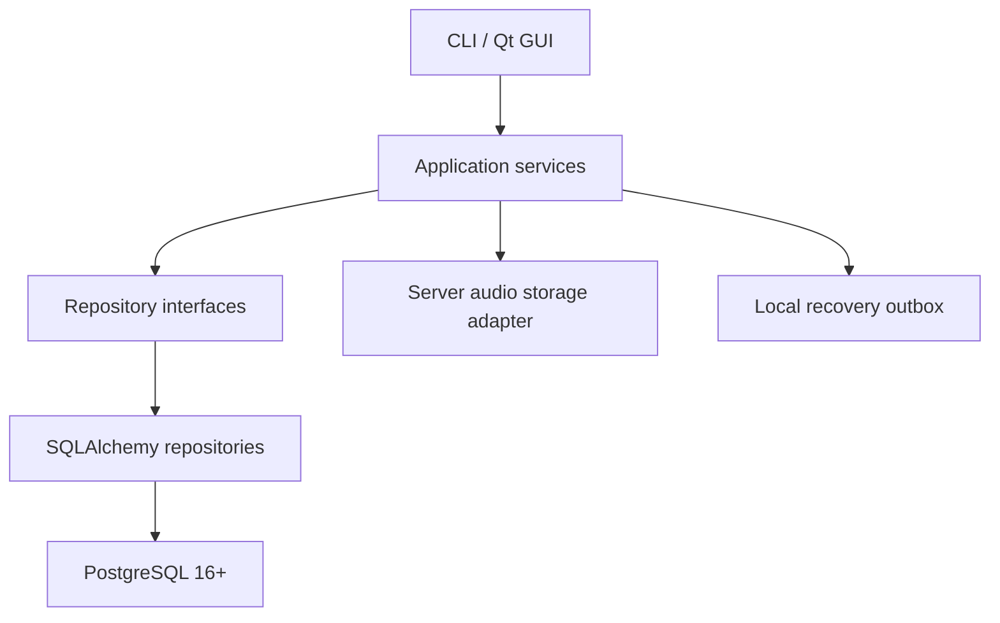
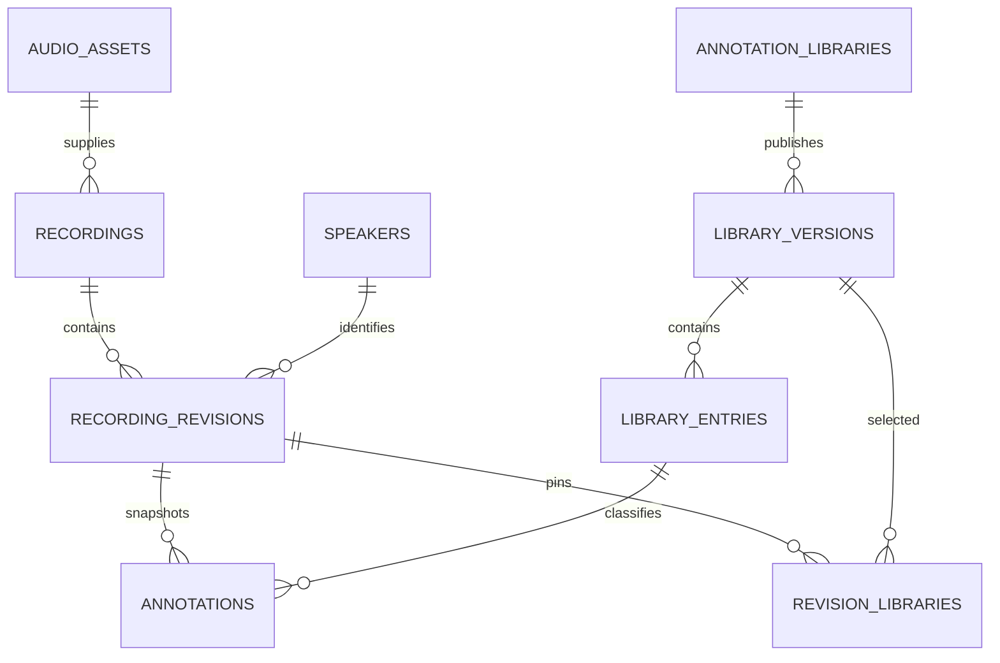

# Alignment Workbench Persistence Architecture

**Status:** Implemented persistence baseline
**Date:** 2026-08-30  
**Current implementation phase:** Database foundation and model-facing persistence layer

## 1. Purpose

This document defines the persistence architecture owned by `alignment-workbench`. The concrete
repository and transaction behavior is documented in
[SQLAlchemy Persistence Layer](SQLAlchemy_Persistence_Layer.md). Audio transfer, the future
interaction engine, and GUI integration remain separate work.

The database foundation must support:

- Immutable annotated-recording snapshots.
- Linear recording-revision history.
- Versioned annotation libraries.
- Sparse point, interval, time-frequency box, and time-frequency polygon annotations.
- Exactly one immutable audio asset reference per recording.
- Audio files stored on the server filesystem, never in PostgreSQL.
- A server-backed audio URI returned with recording, alignment, and segment data.
- Fast trusted reads without repeated aggregate validation.
- Atomic PostgreSQL saves.
- A future local recovery outbox when PostgreSQL cannot be reached.

There are intentionally **no semantic annotation relations**. Do not add a relation table, source/target annotation fields, annotation hierarchy, containment links, adjacency links, or a generic graph mechanism.

## 2. Binding constraints

1. This is a clean rebuild. There is no SQLite compatibility layer and no legacy-data conversion requirement.
2. PostgreSQL is the authoritative metadata and annotation store.
3. PostgreSQL stores no WAV data, binary audio, large objects, or audio derivatives.
4. Audio is immutable and stored locally on the server filesystem.
5. Every recording references exactly one audio asset. A recording never switches audio through an annotation revision.
6. Identical audio content may be represented by one `audio_assets` row and server file, while distinct logical recordings remain separate `recordings` rows referencing it.
7. Time is stored as integer sample positions. Floating-point seconds are derived presentation values.
8. Recording history consists of complete immutable snapshots, not diffs, event sourcing, branches, or merges.
9. Annotation libraries and published library versions are immutable once published.
10. No PostgreSQL enum types are used. Controlled values use checked text.
11. GUI and CLI code never query SQLAlchemy tables directly. They use application services and repository interfaces.
12. The separate spectrogram application is not modified as part of the database work.

## 3. System boundary



The layers have different responsibilities:

| Layer                   | Responsibility                                                                                |
| ----------------------- | --------------------------------------------------------------------------------------------- |
| Pydantic domain models  | Portable snapshots, immutability, deterministic JSON, validation at untrusted boundaries      |
| Application services    | Use-case orchestration, database-dependent validation, audio resolution, transaction requests |
| Repository interfaces   | Backend-independent persistence contracts                                                     |
| SQLAlchemy repositories | Row queries, trusted hydration, inserts, transaction participation                            |
| PostgreSQL              | Authoritative state, referential integrity, uniqueness, basic shape checks, indexes           |
| Server audio adapter    | Resolve a stored audio URI and materialize audio for a client                                 |
| Local recovery outbox   | Preserve unsynchronized edits when PostgreSQL is unavailable                                  |

Pydantic models must not become SQLAlchemy ORM classes. A domain snapshot is an aggregate assembled from multiple tables; an ORM class represents one database row.

## 4. Deployment topology

The current database environment is:

- PostgreSQL 16 on the Hetzner Ubuntu server.
- Database: `registry_align`.
- Owner/migration role: `registry_align_owner`.
- Runtime role: `registry_align_app`.
- PostgreSQL listens on the server loopback interface.
- The local application connects through an SSH tunnel, normally `127.0.0.1:5433` to server `127.0.0.1:5432`.
- The connection URL is supplied through `REGISTRY_ALIGN_DATABASE_URL`.

Audio is stored in a configurable server-side corpus root. No absolute server path is part of the portable domain model. PostgreSQL stores a stable logical URI and an integrity hash.

Recommended URI form:

```text
registry-audio://assets/<audio-asset-uuid>
```

The future server-audio adapter maps that URI to the physical server file and retrieves it through the configured transport. A raw server URI such as `file:///srv/...` must not be handed directly to the workstation application because it would resolve against the workstation filesystem.

SQLAlchemy returns the URI and audio metadata as part of the recording snapshot. SQLAlchemy never opens, streams, copies, or decodes the audio file.

## 5. Canonical database schema

All application tables live in the PostgreSQL schema `registry_align`.



### 5.1 `audio_assets`

| Column               | Type        | Rules                                                |
| -------------------- | ----------- | ---------------------------------------------------- |
| `id`                 | UUID        | Primary key; `gen_random_uuid()` fallback            |
| `storage_uri`        | TEXT        | Required, nonempty, and unique                        |
| `sha256`             | TEXT        | Required, unique, lowercase 64-character hexadecimal |
| `logical_path`       | TEXT        | Optional provenance only; not authoritative identity |
| `media_type`         | TEXT        | Optional                                             |
| `original_extension` | TEXT        | Optional                                             |
| `codec`              | TEXT        | Optional                                             |
| `sample_rate_hz`     | INTEGER     | Greater than zero                                    |
| `frame_count`        | BIGINT      | Greater than zero                                    |
| `channels`           | INTEGER     | Greater than zero                                    |
| `source_metadata`    | JSONB       | Required JSON object; default `{}`                   |
| `created_at`         | TIMESTAMPTZ | Required; server default `now()`                     |

`sha256` deduplicates identical bytes. `storage_uri` identifies the one canonical server file for
the asset and uses `registry-audio://assets/<audio-asset-uuid>`. Relative server-storage keys do
not cross the application boundary. PostgreSQL enforces that the value is nonempty; the future
service validates the exact scheme and UUID form. The file must exist before an authoritative
recording is committed.

The domain and database both use `storage_uri`. It is the authoritative logical locator;
`logical_path` is optional provenance or display information only.

### 5.2 `speakers`

| Column         | Type        | Rules                              |
| -------------- | ----------- | ---------------------------------- |
| `id`           | UUID        | Primary key                        |
| `external_key` | TEXT        | Optional; unique when present      |
| `display_name` | TEXT        | Required, nonempty                 |
| `metadata`     | JSONB       | Required JSON object; default `{}` |
| `created_at`   | TIMESTAMPTZ | Required                           |

The current domain model uses `default_speaker_ref: UUID | None`. Recording revisions therefore
store the reference as a nullable UUID foreign key to `speakers.id`.

### 5.3 `annotation_libraries`

| Column        | Type        | Rules                                                         |
| ------------- | ----------- | ------------------------------------------------------------- |
| `id`          | UUID        | Primary key                                                   |
| `namespace`   | TEXT        | Required, unique, checked against the domain namespace format |
| `name`        | TEXT        | Required, nonempty                                            |
| `description` | TEXT        | Optional                                                      |
| `owner_label` | TEXT        | Optional                                                      |
| `created_at`  | TIMESTAMPTZ | Required                                                      |

Library identity is stable. Descriptive catalog fields may be updated later through an explicit catalog operation.

### 5.4 `library_versions`

| Column           | Type        | Rules                                                    |
| ---------------- | ----------- | -------------------------------------------------------- |
| `id`             | UUID        | Primary key                                              |
| `library_id`     | UUID        | Required FK to `annotation_libraries`; delete restricted |
| `version_label`  | TEXT        | Required and checked against the domain format           |
| `content_sha256` | TEXT        | Required lowercase SHA-256                               |
| `created_at`     | TIMESTAMPTZ | Required                                                 |
| `author`         | TEXT        | Optional                                                 |
| `description`    | TEXT        | Optional                                                 |

Required uniqueness:

- `(library_id, version_label)`
- `(library_id, content_sha256)`
- `(id, library_id)` when needed by composite integrity rules

Published versions are immutable.

### 5.5 `library_entries`

| Column                   | Type    | Rules                                                            |
| ------------------------ | ------- | ---------------------------------------------------------------- |
| `id`                     | UUID    | Primary key                                                      |
| `library_version_id`     | UUID    | Required FK; delete restricted                                   |
| `position`               | INTEGER | Required, nonnegative, unique inside a version                   |
| `entry_key`              | TEXT    | Required and checked against the domain format                   |
| `display_name`           | TEXT    | Required, nonempty                                               |
| `description`            | TEXT    | Required; empty text remains allowed by the current domain model |
| `allowed_geometry_types` | TEXT[]  | Required, nonempty, values restricted by CHECK                   |
| `attribute_schema`       | JSONB   | Required JSON object                                             |
| `validation_hints`       | JSONB   | Required JSON object                                             |
| `display_hints`          | JSONB   | Required JSON object                                             |
| `metadata`               | JSONB   | Required JSON object                                             |

Required uniqueness:

- `(library_version_id, entry_key)`
- `(library_version_id, position)`
- `(id, library_version_id)` to support an annotation composite foreign key

Entry order is stored explicitly because PostgreSQL never guarantees row order. JSON Schema evaluation does not run inside PostgreSQL.

### 5.6 `recordings`

| Column             | Type        | Rules                                                               |
| ------------------ | ----------- | ------------------------------------------------------------------- |
| `id`               | UUID        | Primary key                                                         |
| `audio_asset_id`   | UUID        | Required FK to exactly one immutable audio asset; delete restricted |
| `head_revision_id` | UUID        | Nullable only before the first revision is installed                |
| `created_at`       | TIMESTAMPTZ | Required                                                            |

`audio_asset_id` is immutable. It is not unique because deduplicated identical audio may be referenced by distinct logical recordings. Each recording nevertheless has exactly one audio asset.

`head_revision_id` is the only routinely mutable part of the canonical recording aggregate.

### 5.7 `recording_revisions`

| Column                | Type        | Rules                                          |
| --------------------- | ----------- | ---------------------------------------------- |
| `id`                  | UUID        | Primary key                                    |
| `recording_id`        | UUID        | Required FK to `recordings`; delete restricted |
| `revision_number`     | INTEGER     | Required and greater than zero                 |
| `parent_revision_id`  | UUID        | Null only for revision 1                       |
| `schema_version`      | TEXT        | Currently checked as `1.0`                     |
| `name`                | TEXT        | Required, nonempty                             |
| `default_speaker_ref` | UUID        | Optional FK to `speakers.id`                   |
| `language`            | TEXT        | Required, nonempty                             |
| `created_at`          | TIMESTAMPTZ | Required                                       |
| `author`              | TEXT        | Optional                                       |
| `message`             | TEXT        | Optional                                       |

Required integrity:

- Unique `(recording_id, revision_number)`.
- Unique `(recording_id, id)` for composite foreign keys.
- Composite parent FK `(recording_id, parent_revision_id)` to `(recording_id, id)`.
- Partial unique index on non-null `parent_revision_id` to prevent branching.
- Revision 1 has no parent; later revisions require a parent.
- Composite head FK `(recordings.id, recordings.head_revision_id)` to `(recording_id, id)` so a recording cannot point at another recording's revision.

Every revision is a full immutable snapshot. No revision row is updated after insertion.

### 5.8 `recording_revision_libraries`

| Column                  | Type    | Rules                          |
| ----------------------- | ------- | ------------------------------ |
| `recording_revision_id` | UUID    | Required FK; delete restricted |
| `library_version_id`    | UUID    | Required FK; delete restricted |
| `position`              | INTEGER | Required and nonnegative       |

Primary key:

```text
(recording_revision_id, library_version_id)
```

Additional uniqueness:

```text
(recording_revision_id, position)
```

The pin stores a library-version ID. Namespace, version label, and content hash are reconstructed from the immutable library rows when a portable snapshot is loaded.

### 5.9 `annotations`

| Column                  | Type             | Rules                                                         |
| ----------------------- | ---------------- | ------------------------------------------------------------- |
| `recording_revision_id` | UUID             | Required                                                      |
| `annotation_id`         | UUID             | Required; stable logical annotation identity across snapshots |
| `position`              | INTEGER          | Required and nonnegative                                      |
| `library_version_id`    | UUID             | Required                                                      |
| `library_entry_id`      | UUID             | Required                                                      |
| `geometry_type`         | TEXT             | Checked controlled value                                      |
| `start_sample`          | BIGINT           | Required and nonnegative                                      |
| `end_sample`            | BIGINT           | Nullable according to geometry type                           |
| `min_frequency_hz`      | DOUBLE PRECISION | Nullable according to geometry type; finite when present      |
| `max_frequency_hz`      | DOUBLE PRECISION | Nullable according to geometry type; finite when present      |
| `polygon_vertices`      | JSONB            | Required only for polygons; ordered JSON array                |
| `attributes`            | JSONB            | Required JSON object; default `{}`                            |
| `confidence`            | DOUBLE PRECISION | Optional; zero through one                                    |
| `note`                  | TEXT             | Optional                                                      |
| `provenance_ref`        | TEXT             | Optional portable reference; not a database FK in this phase  |

Primary key:

```text
(recording_revision_id, annotation_id)
```

`annotation_id` is not globally unique because the same annotation identity may appear in several complete revisions.

Required composite foreign keys:

```text
(recording_revision_id, library_version_id)
    -> recording_revision_libraries

(library_entry_id, library_version_id)
    -> library_entries
```

Together these ensure that an annotation uses a real entry from a library version pinned by the same revision.

Geometry checks enforce the nullable/required column shape:

| Geometry                 | Required                                               | Must be null                |
| ------------------------ | ------------------------------------------------------ | --------------------------- |
| `point`                  | `start_sample`                                         | end, frequencies, vertices  |
| `time_interval`          | start and end                                          | frequencies, vertices       |
| `time_frequency_box`     | start, end, min/max frequency                          | vertices                    |
| `time_frequency_polygon` | start, end, min/max frequency, at least three vertices | none of the geometry fields |

PostgreSQL checks scalar ordering and JSON container shape. It does not perform cross-table audio-bound checks, inspect every polygon vertex, or execute library JSON Schemas.

## 6. Index plan

Indexes are deliberately conservative because the server has limited storage. Primary keys and unique constraints already create indexes and must not be duplicated.

| Table                          | Additional index                                     | Purpose                                  |
| ------------------------------ | ---------------------------------------------------- | ---------------------------------------- |
| `speakers`                     | Partial unique `external_key` where non-null         | External identity lookup                 |
| `recordings`                   | `(audio_asset_id)`                                   | Find logical recordings for an asset     |
| `recording_revisions`          | `(recording_id, created_at DESC)`                    | History listing                          |
| `recording_revisions`          | Partial unique `(parent_revision_id)` where non-null | Prevent branches and find child          |
| `library_versions`             | `(library_id, created_at DESC)`                      | Version listing                          |
| `recording_revision_libraries` | `(library_version_id)`                               | Reverse FK lookup                        |
| `annotations`                  | Unique `(recording_revision_id, position)`           | Stable complete-snapshot order           |
| `annotations`                  | `(recording_revision_id, start_sample)`              | Timeline ordering and viewport filtering |
| `annotations`                  | `(library_entry_id, recording_revision_id)`          | Cross-recording concept lookup           |

Do not initially create blanket JSONB GIN indexes, full-text indexes, a low-cardinality `geometry_type` index, or a GiST range index. Add them only after a measured query and `EXPLAIN ANALYZE` demonstrate a need.

## 7. Immutability and deletion behavior

Canonical history uses insert-only rows:

- `audio_assets`: insert/select only.
- `library_versions`: insert/select only.
- `library_entries`: insert/select only.
- `recording_revisions`: insert/select only.
- `recording_revision_libraries`: insert/select only.
- `annotations`: insert/select only.
- `recordings`: insert/select plus a narrowly controlled update to `head_revision_id`.

Foreign keys for canonical data use `ON DELETE RESTRICT`. A future operational run-history subsystem may have explicit cleanup rules, but it is outside the first database foundation.

The owner role performs DDL and migrations. Runtime privileges prevent the application role from updating or deleting immutable history. Role creation and environment-specific grants do not belong in portable Alembic revisions.

## 8. SQLAlchemy architecture

The implemented package boundary is:

```text
alignment-workbench/
    src/
        models.py
        application/
            persistence.py
            read_models.py
            errors.py
        persistence/
            sqlalchemy/
                base.py
                engine.py
                rows.py
                session.py
                mappers.py
                audio_asset_repository.py
                speaker_repository.py
                library_repository.py
                recording_queries.py
                recording_repository.py
                unit_of_work.py
```

The package implements bounded reads, centralized hydration, focused repositories, and a
transaction-owning facade. Audio retrieval, GUI integration, the interaction engine, and recovery
synchronization are still separate concerns.

### 8.1 Metadata

Use SQLAlchemy 2.x typed declarative mappings and a deterministic naming convention:

```python
NAMING_CONVENTION = {
    "ix": "ix_%(table_name)s_%(column_0_N_name)s",
    "uq": "uq_%(table_name)s_%(column_0_N_name)s",
    "ck": "ck_%(table_name)s_%(constraint_name)s",
    "fk": "fk_%(table_name)s_%(column_0_N_name)s_%(referred_table_name)s",
    "pk": "pk_%(table_name)s",
}
```

All metadata uses schema `registry_align`. Use PostgreSQL UUID, JSONB, ARRAY, and timezone-aware timestamps where appropriate. Use checked text rather than PostgreSQL enums.

### 8.2 Engine and sessions

Use Psycopg 3 and synchronous SQLAlchemy:

```python
engine = create_engine(
    database_url,
    pool_size=2,
    max_overflow=3,
    pool_pre_ping=True,
)
```

The URL uses the `postgresql+psycopg` dialect and comes only from `REGISTRY_ALIGN_DATABASE_URL`. Credentials are never committed.

Rules:

- The engine may be shared across threads.
- A `Session` may not be shared across threads.
- Open one short-lived session per application transaction.
- Use `with session.begin():` for transactional operations.
- Use `expire_on_commit=False`.
- Use `lazy="raise"` on ORM relationships unless a query explicitly loads them.
- Do not return ORM rows outside the SQLAlchemy repository layer.
- A future Qt application runs synchronous repository calls in worker threads.

## 9. Validation boundaries

Validation is intentionally concentrated at trust boundaries.

| Boundary                      | Behavior                                                                           |
| ----------------------------- | ---------------------------------------------------------------------------------- |
| External registry/JSON import | Full Pydantic, aggregate, library, and geometry validation                         |
| New or edited GUI annotation  | Validate only the affected annotation; GUI operations remain valid by construction |
| Save of existing GUI state    | Perform only database-dependent and concurrency checks                             |
| PostgreSQL write              | Always enforce cheap constraints, uniqueness, and foreign keys                     |
| Normal PostgreSQL read        | Trusted hydration; do not revalidate the full snapshot                             |
| Local recovery file           | Full validation before synchronization                                             |
| Explicit maintenance audit    | Full database-to-domain validation on demand                                       |

The future SQLAlchemy mapper may use Pydantic `model_construct()` only in one private trusted hydration path and only for rows read from the constrained PostgreSQL schema. It must explicitly construct nested domain objects before constructing the aggregate.

Full validation is still required for untrusted files, imported data, backups, API payloads, and audit operations. JSON Schema validators should be compiled and cached by immutable library-version hash. Unchanged annotations should not be revalidated on every save.

## 10. Implemented read path

Loading a current snapshot should use bounded queries instead of one row-multiplying join:

1. Load the recording, head revision, audio asset, and optional speaker reference.
2. Load pinned library versions ordered by `position`.
3. Load annotations plus their resolved library entries ordered by `position`.
4. Construct the trusted `AnnotatedRecordingSnapshot`.
5. Return the snapshot, including `audio_asset.storage_uri`, to the application service.
6. Let the server-audio adapter resolve or materialize the audio independently.

## 11. Implemented atomic save path

A future snapshot save is one PostgreSQL transaction:

1. The GUI or importer produces a complete save request.
2. Write the complete request atomically to the local recovery outbox.
3. Open a short-lived SQLAlchemy session and transaction.
4. Bulk-resolve pinned versions and referenced entries.
5. Perform only required database-dependent validation.
6. Lock the recording row using `SELECT ... FOR UPDATE`.
7. Compare `head_revision_id` with `expected_parent_revision_id`.
8. Allocate the next revision number.
9. Insert the immutable revision, pins, and annotations.
10. Update `recordings.head_revision_id`.
11. Commit and close the session.
12. Mark the local recovery item synchronized.

A failed transaction changes nothing in PostgreSQL and leaves the prior head valid.

## 12. Future local recovery outbox

The recovery mechanism is not a second authoritative backend and does not use SQLite. It is a local directory of complete deterministic JSON save requests.

```text
recovery/
    last-synced/
        <recording-id>.json
    pending/
        <recording-id>-<timestamp>.json
```

Before a remote save attempt, the client writes a temporary file, flushes it, and atomically replaces the recovery target. A failed connection leaves the pending request recoverable.

On reconnection:

1. Validate the recovery envelope fully.
2. Read the current PostgreSQL head.
3. Compare it with the saved `expected_parent_revision_id`.
4. Synchronize only when they match.
5. Stop and report a stale-save conflict when they do not match.

There is no automatic merge. Recovery JSON contains the snapshot, URI, and audio hash but not audio bytes.

## 13. Audio/database consistency

PostgreSQL and the server filesystem cannot participate in one shared transaction. The future audio-ingestion workflow therefore follows this order:

1. Inspect and hash the incoming audio.
2. Upload or copy it to a temporary file under the server audio root.
3. Atomically rename it to its immutable final location.
4. Create the `audio_assets` and `recordings` rows in one PostgreSQL transaction.
5. If the database transaction fails, remove or later reconcile the unreferenced server file.

The reverse ordering is not used because it could commit a recording whose audio file does not exist.

## 14. Current exclusions

The persistence layer does not implement:

- The interaction engine or editing use-case services.
- GUI integration.
- Audio upload, SFTP, download, caching, playback, or decoding.
- Local recovery outbox runtime.
- Automatic alignment, MFA, spectrogram, or signal-analysis code.
- Legacy SQLite imports or compatibility.
- Semantic annotation relations or hierarchy.
- Diff/event-sourced revision replay.
- Operational run-history cleanup.

The database shape and repositories are established. Later work connects the interaction engine
and recovery workflow through these stable application protocols.
