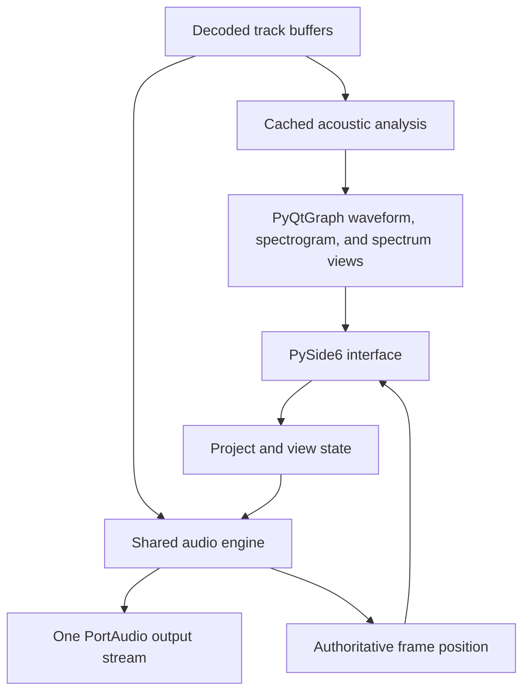

# Spectrogram Playground

## Purpose

Build a native desktop application for exploring and comparing recordings of voices. The application should behave like a lightweight audio-analysis workstation: users add several tracks, inspect them on one shared timeline, seek and play from any visible point, select regions, and switch among waveform, spectrogram, and Fourier views without losing position or context.

This is the first practical tool in the broader accent-research project. It is intended to make acoustic patterns visible and understandable before any accent classifier, accent score, or coaching model is introduced.

## Product goals

- Make speech waveforms and spectra easy to explore interactively.
- Allow several voices to be compared on the same timeline.
- Keep playback, playhead movement, selection, pan, and zoom synchronized across tracks.
- Show useful acoustic patterns.
- Preserve analysis settings and timeline state while switching views.
- Establish reusable audio, visualization, and state-management foundations for later accent research.

## Non-goals

The initial version will not include:

- Accent classification or scoring
- Automatic accent judgments
- Phoneme recognition or forced alignment
- Dynamic time warping
- Difference spectrograms
- Effects or production-oriented destructive processing beyond selection cut/copy/paste/move
- Draggable clip offsets
- Cloud uploads, user accounts, or a database
- A browser-based interface
- A full digital audio workstation

## Recommended implementation approach

Treat the desktop application as a greenfield build. Do not attempt to preserve the Streamlit interface.

If the earlier prototype contains correct and tested signal-processing functions, copy or adapt those functions into the new analysis package only after inspecting them. The interface, application state, and playback architecture should be designed specifically for a native desktop program.

The safest workflow is to build in a new directory or branch and retain the earlier prototype until the desktop application passes its acceptance tests. There is no need to delete the old implementation first.

## Technology decisions

| Responsibility               | Technology                     | Reason                                                                                 |
| ---------------------------- | ------------------------------ | -------------------------------------------------------------------------------------- |
| Desktop interface            | PySide6 / Qt Widgets           | Mature native desktop controls, events, shortcuts, layouts, and cross-platform support |
| Interactive waveform plots   | PyQtGraph                      | Fast scientific plotting, linked axes, clipping, and downsampling                      |
| Spectrogram rendering        | PyQtGraph `ImageItem`          | Efficient display of time-frequency matrices within linked timeline views              |
| Playback and recording       | python-sounddevice / PortAudio | Callback-based input and output using NumPy buffers                                    |
| Numerical processing         | NumPy and SciPy                | Core array operations, windows, filtering, FFT, and Welch spectra                      |
| Speech analysis              | librosa                        | STFT, Mel filters, pitch estimation, and audio utilities                               |
| Common lossless file loading | soundfile                      | Direct loading of WAV, FLAC, and OGG into NumPy arrays                                 |
| Tests                        | pytest and pytest-qt           | Analysis, state, audio-engine, and Qt interaction tests                                |
| Packaging                    | PyInstaller                    | Local desktop executable packaging, initially targeting Windows                        |

Use a stable supported Python version rather than the newest prerelease. Define dependencies and tool configuration in `pyproject.toml`.

## Architectural principles

### The audio stream owns time

The authoritative playhead position must come from the number of audio frames processed by the output stream. A UI timer may redraw the playhead, but it must not determine playback time.

All audible tracks are mixed into one output callback. Do not create an independent media player for every track, because separately started players can drift.

### The audio callback does minimal work

The real-time callback may:

- Read the current transport state
- Copy and mix already prepared track samples
- Apply track gain, mute, and solo state
- Handle selection looping
- Advance the shared sample position
- Fill the requested output buffer

It must not:

- Calculate an FFT or spectrogram
- Decode files
- Allocate large arrays
- Perform file or network I/O
- Acquire long-lived locks
- Modify Qt widgets
- Log on every callback

Use preallocated buffers and a small thread-safe command or state-transfer mechanism between the UI thread and audio callback.

### Playback and analysis sample rates are separate concepts

Retain the decoded source audio and its metadata. Prepare playback buffers at one project/device sample rate, commonly 48 kHz when supported. Generate a separate analysis representation at a configurable speech-analysis sample rate, with 16 kHz as a reasonable initial default.

Do not silently treat the analysis sample rate as the playback-device rate. The interface should disclose both when they differ.

### Navigation must not trigger analysis

Moving the playhead, changing the selection, panning, or zooming must never recompute the STFT. Cache expensive derived data using a key containing the track identity, preprocessing configuration, and analysis parameters.

### State remains independent of widgets

Qt widgets render and modify application state, but they should not be the only location where that state exists. Track, transport, selection, viewport, and analysis settings should be represented by testable Python models.

## High-level architecture



## Suggested repository structure

```text
accent-audio-explorer/
    app.py
    pyproject.toml
    README.md
    LICENSE

    spectrogram_playground/
        accent_audio_explorer/
            __init__.py
            application.py

            model/
                project.py
                track.py
                transport.py
                selection.py
                viewport.py
                settings.py

            audio/
                engine.py
                mixer.py
                recording.py
                decoding.py
                resampling.py

            analysis/
                preprocessing.py
                waveform_lod.py
                spectrogram.py
                spectrum.py
                pitch.py
                cache.py

            ui/
                main_window.py
                transport_toolbar.py
                timeline_ruler.py
                track_workspace.py
                track_header.py
                linked_view.py
                waveform_view.py
                spectrogram_view.py
                fourier_view.py
                analysis_settings.py
                pattern_guide.py

            resources/
                styles.qss

    tests/
        unit/
        integration/
        ui/
```

The exact file boundaries may change during implementation, but signal processing, the audio engine, state models, and widgets should remain separate.

## Core domain models

### Project

The project owns:

- Stable project ID
- Ordered collection of tracks
- Project playback sample rate
- Duration of the longest track
- Active track ID
- Shared transport state
- Shared time selection
- Shared viewport
- Shared analysis settings

### Track

Each track contains:

- Stable UUID
- Editable name
- Display color
- Source path or recording origin
- Original sample rate and channel count
- Original decoded samples
- Playback samples at the project rate
- Optional analysis samples at the configured analysis rate
- Gain
- Mute, solo, and visibility flags
- Duration and metadata
- Cached derived-feature references

Track identity must not depend on its index in the visible list.

### Transport

Transport state contains:

- Stopped, playing, or paused state
- Current sample-frame position
- Playback rate if supported safely
- Loop-selection flag
- Follow-playhead flag
- Active playback range

### Selection

Selection state contains:

- Optional start time
- Optional end time
- Derived duration
- Validation that start is never after end

Each track retains its own selection. The active track's selection drives Fourier analysis, looping, and editing.

### Viewport

Viewport state contains:

- Visible start time
- Visible end time
- Minimum permitted width
- Project-duration clamping

All time-based track views consume the same viewport.

## Audio-engine design

### Import and preparation

On import:

- Decode the file outside the callback thread.
- Preserve original metadata.
- Convert multichannel input to mono for the initial analysis workspace, while documenting the conversion.
- Resample a copy to the project playback rate.
- Create waveform display levels or min/max envelopes for responsive zooming.
- Queue spectrogram and pitch calculation outside the UI and audio threads.

### Mixing

The output callback receives a frame count and fills one output buffer.

For every audible track:

- Read the corresponding interval from its playback buffer.
- Substitute silence after the track ends.
- Apply gain.
- Add it to the mix buffer.

Apply safe final level handling before output. Track and report callback underflows rather than hiding them.

### Seeking and looping

Seeking changes the shared project frame position. Pausing preserves it. Stopping returns to the selection start when a selection exists, otherwise to zero.

When looping a selection, handle a loop boundary that occurs inside an output buffer by copying the tail before the boundary and the remaining samples from the selection start.

### UI synchronization

A Qt timer running around 30–60 Hz reads the authoritative frame position and moves the visual playhead. It should update only the necessary graphical items.

## Interface design

### Main window

Use a compact, dark, desktop-editor layout containing:

- Menu bar
- Persistent transport toolbar
- Shared timeline ruler
- Tab bar for Waveform, Spectrogram, and Fourier Transform
- Scrollable multitrack workspace
- Collapsible analysis-settings panel
- Collapsible educational pattern guide
- Status bar with cursor time, selection duration, project rate, and device state

Avoid dashboard cards, oversized headings, and large explanatory sections above the workspace.

### Transport toolbar

Include:

- Add track
- Record track
- Play/pause
- Stop
- Jump to beginning and end
- Current time display
- Loop selection
- Follow playhead
- Zoom in and out
- Zoom to selection
- Fit project
- Reset zoom

### Track controls

Each stacked track has a fixed-width header with:

- Editable name
- Color indicator
- Active-track state
- Mute
- Solo
- Hide/show
- Gain
- Remove
- Duration and sample-rate summary

The header remains visible while the content pans horizontally.

### Interaction modes

Support explicit tools:

- Seek: left-click or left-drag the playhead to a time.
- Select: Ctrl+left-drag a time interval on one track and make that track active.
- Pan: middle-drag the visible time range without moving the playhead.
- Edit: copy, cut, delete, paste, or move the selected audio on the active track.

Mouse-wheel and toolbar zoom should operate around the cursor or playhead. Linked views must share the same x-range.

### Waveform view

- Stack all visible tracks vertically.
- Use track colors consistently.
- Render the shared playhead and selection across every lane.
- Use level-of-detail envelopes or display downsampling for long signals.
- Allow track-specific vertical amplitude scaling without changing the time viewport.

### Spectrogram view

- Stack all visible tracks against the same timeline.
- Render STFT matrices as images using a consistent frequency range, dynamic range, and color scale.
- Offer linear-frequency and Mel modes.
- Allow optional F0 and RMS overlays.
- Keep formants explicitly experimental if added.
- Apply parameter changes consistently to all tracks by default.

### Fourier view

Analyze the active track's selection. If no selection exists, analyze a short window centered on the playhead.

Provide:

- Overlay mode using stable track colors
- Stacked mode with identical axes
- Magnitude, power, and decibel scales
- Linear and logarithmic frequency axes
- A window-function selector
- Short-window FFT for brief selections
- An averaged spectrum or Welch PSD for longer selections

Always show the time region used for the calculation.

## Performance strategy

- Precompute multiresolution waveform envelopes.
- Use PyQtGraph clipping and downsampling for visible waveform segments.
- Cache STFT, Mel, pitch, and RMS results.
- Calculate expensive features in worker threads or a thread pool.
- Update Qt widgets only on the main thread.
- Keep audio buffers independent of displayed data resolution.
- Avoid rebuilding all track widgets when one property changes.
- Measure callback underflows and UI frame latency during development.

For the initial version, favor recordings measured in seconds or minutes rather than hour-long sessions. Tiled spectrogram computation can be added later if needed.

## Implementation phases

### Foundation

- Create the package, dependency configuration, logging, and test setup.
- Establish `Project`, `Track`, `Transport`, `Selection`, and `Viewport` models.
- Create a main Qt window with an empty project state.
- Add a deterministic generated-signal fixture for development.

### One-track vertical slice

- Import one WAV file.
- Display its waveform.
- Play it through one output stream.
- Drive the playhead from processed sample frames.
- Implement play, pause, stop, seek, and fit-project.
- Validate actual playback and displayed time before adding complexity.

### Multitrack playback

- Add multiple tracks without replacing existing ones.
- Implement mixing, mute, solo, and gain.
- Handle different durations safely.
- Add removal, renaming, stable IDs, and ordering.
- Test that all tracks use one shared clock.

### Timeline interaction

- Add shared seek, selection, pan, and zoom behavior.
- Link x-ranges across every visible track.
- Add loop-selection and follow-playhead behavior.
- Preserve state across tabs.

### Spectrogram workspace

- Add cached STFT and Mel computation.
- Render aligned multitrack spectrograms.
- Add frequency, window, hop, FFT-size, and dynamic-range controls.
- Add F0 and energy overlays.

### Fourier comparison

- Analyze the selection or a playhead-centered window.
- Add overlay and stacked comparison layouts.
- Add FFT and Welch-spectrum modes appropriate to selection duration.

### Recording, export, and polish

- Add microphone recording as a new track.
- Add PNG, CSV, and settings export.
- Add shortcuts, status messages, errors, and empty states.
- Complete dark styling and accessibility labels.
- Add packaging scripts and Windows executable verification.

## Automated validation

### Analysis tests

- A 440 Hz sine produces a peak near 440 Hz.
- A two-tone input produces both expected peaks.
- STFT and Mel outputs have valid shapes and finite values.
- F0 uses missing values rather than zero for unvoiced frames.
- Long-selection spectral averaging is deterministic.

### Model tests

- Track IDs remain stable after reorder and deletion.
- Project duration equals the longest track.
- Selection and viewport ranges are clamped safely.
- Tab changes do not alter playhead, selection, or viewport state.
- Mute and solo produce the correct audible-track set.

### Audio-engine tests

- Mixing two known signals produces the expected buffer.
- Gain and mute behave correctly.
- Short tracks contribute silence after ending.
- Seeking chooses the correct source samples.
- Looping handles a boundary inside a callback buffer.
- The frame position advances by exactly the emitted frame count.

### UI tests

- Tracks can be added, renamed, reordered, and removed.
- Linked views maintain the same x-range.
- Clicking a track updates the shared playhead.
- Drag selection updates the shared model.
- Switching tabs preserves state.
- Fourier analysis receives the selected interval.

## Manual acceptance workflow

- Launch the desktop app on Windows.
- Add three voice recordings with different lengths.
- Confirm the tracks appear vertically on one timeline.
- Seek from a waveform and begin playback at that location.
- Pause and resume without jumping.
- Mute one track and solo another.
- Select a short interval and loop it.
- Pan and zoom while keeping every track aligned.
- Switch to the spectrogram view without changing the playhead, selection, or viewport.
- Click inside a spectrogram and begin playback from that point.
- Inspect the selected interval in Fourier overlay and stacked modes.
- Record a new microphone track.
- Remove a track while stopped and confirm the remaining project remains valid.
- Run the full test suite and package a local executable.

## Definition of done

The first release is complete when:

- The program launches as a native desktop application.
- Multiple tracks can be loaded and compared.
- All tracks use one shared playback clock.
- The moving playhead reflects actual processed audio frames.
- Seeking, Ctrl-drag selection, middle-drag pan, and zoom work across tracks.
- Copy, cut, delete, paste-at-playhead, and move-to-playhead work on the active track.
- Waveform, spectrogram, and Fourier views share state.
- Mute, solo, gain, loop, and follow-playhead work.
- Spectral analysis is cached and never runs inside the audio callback.
- Generated-signal, model, mixer, and core UI tests pass.
- The complete manual acceptance workflow has been performed.
- Setup, run, test, and packaging instructions are documented.

## Future extensions

- Word- and phone-level annotations
- Forced alignment
- Dynamic time warping between matched utterances
- Aligned log-spectrogram differences
- Group-average accent visualizations
- Speaker and channel normalization
- Vowel-space and formant-trajectory views
- VOT and fricative spectral measurements
- Annotation export for later modeling
- Accent-identification baselines using speaker-disjoint evaluation

## References

- [Qt for Python](https://doc.qt.io/qtforpython-6/index.html)
- [PyQtGraph](https://pyqtgraph.readthedocs.io/en/latest/)
- [python-sounddevice](https://python-sounddevice.readthedocs.io/)
- [PortAudio callback API](https://portaudio.com/docs/v19-doxydocs/api_overview.html)
- [librosa](https://librosa.org/doc/)
- [SciPy signal processing](https://docs.scipy.org/doc/scipy/reference/signal.html)
